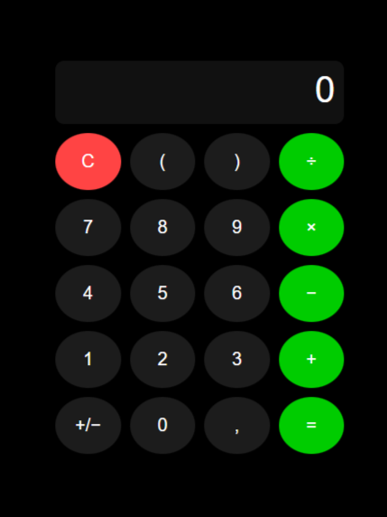

# Simple-Calculator
📟 Simple Calculator A simple and responsive calculator built using HTML, CSS, and JavaScript. 
This project performs basic arithmetic operations like addition, subtraction, multiplication, and division

## Demo
Click here to try
https://varsha-2406.github.io/Simple-Calculator/

## Screenshot
Calculator Simple by Varsha Hadi pratama

## Connect with me

[ TikTok](https://www.tiktok.com/@vrshaa_2)
